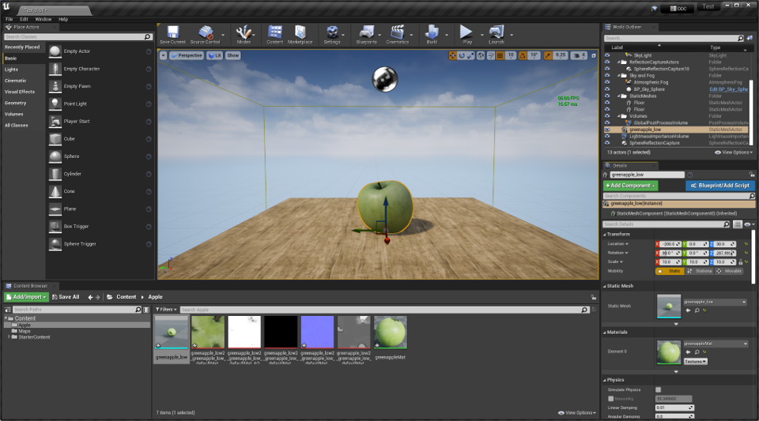

# Game Engines

Game engines are software development tools for creating interactive software. They package together libraries and software which simplify the development of interactive software. Game engines are a widely used tool in the creation of real-time 3D VR software, and many engines support VR production workflows out-of-the-box.

A modern game engine will typically include:

* A 3D or 2D renderer, which supports the rendering of a moving image sequence in real-time.&#x20;
* Editor for compositing and managing scenes and asset import.
* Physics simulation.
* Scripting and programming tools to support dynamic, simulated and interactive elements.
* Sound processing.
* Extension through plugins and/or custom code.

There are numerous engines in use today. For real-time 3D rendering applications such as VR, Unity and Unreal Engine are currently the two most popular. Both are free to download and use non-commercially, which has contributed to their popularity.&#x20;

An important implication of using an engine is that much programming has already happened before work on a project begins. The engines provides a toolset that can be used to realise the project and generate executable software, but as a creator you do not necessarily have full control or authorship of the code.&#x20;

## List of Engines

<table><thead><tr><th width="197.5789473684211">Name</th><th width="150">Platforms</th><th>Download</th></tr></thead><tbody><tr><td><a href="https://developer.valvesoftware.com/wiki/Source">Source</a> / <a href="https://developer.valvesoftware.com/wiki/Source_2">Source 2</a></td><td>Windows</td><td>Binaries distributed through <a href="https://store.steampowered.com/about/">Steam</a>. Source code for 2013 edition available on <a href="https://github.com/ValveSoftware/source-sdk-2013">GitHub.</a></td></tr><tr><td><a href="unity/">Unity</a></td><td>Windows; MacOS (Intel &#x26; M1); Linux (Ubuntu and CentOS)</td><td><a href="https://unity3d.com/get-unity/download/archive">https://unity3d.com/get-unity/download/archive</a></td></tr><tr><td><a href="unreal-engine-4/">Unreal Engine 4 / Unreal Engine 5</a></td><td>Windows; Linux (<a href="https://docs.unrealengine.com/4.27/en-US/SharingAndReleasing/Linux/BeginnerLinuxDeveloper/SettingUpAnUnrealWorkflow/">from source</a>)</td><td>Binaries distributed through <a href="https://www.unrealengine.com/en-US/download">Epic Game Launcher</a>. Source code available on restricted access <a href="https://docs.unrealengine.com/4.27/en-US/ProgrammingAndScripting/ProgrammingWithCPP/DownloadingSourceCode/">GitHub</a> repository.</td></tr><tr><td><a href="https://godotengine.org/">Godot</a></td><td>Android; Linux;  MacOs;Windows; WebEditor</td><td>Binaries and source code available on <a href="https://github.com/godotengine/godot/releases">Github</a> and in <a href="https://godotengine.org/download">download section</a> </td></tr><tr><td></td><td></td><td></td></tr></tbody></table>

## Resources

Adrian Courrèges (2020) Graphics Studies Compilation. URL: [http://www.adriancourreges.com/blog/2020/12/29/graphics-studies-compilation/](http://www.adriancourreges.com/blog/2020/12/29/graphics-studies-compilation/).

baldurk (n.d.). _Graphics in Plain Language: An introduction to how modern graphics work in video games_. URL: [https://renderdoc.org/blog/Graphics-in-Plain-Language/Part-1.html](https://renderdoc.org/blog/Graphics-in-Plain-Language/Part-1.html).

Brown University VR Software Wiki. URL: [https://sites.google.com/view/brown-vr-sw-review-2018/home](https://sites.google.com/view/brown-vr-sw-review-2018/home)

[https://fgiesen.wordpress.com/2011/07/09/a-trip-through-the-graphics-pipeline-2011-index/](https://fgiesen.wordpress.com/2011/07/09/a-trip-through-the-graphics-pipeline-2011-index/)

