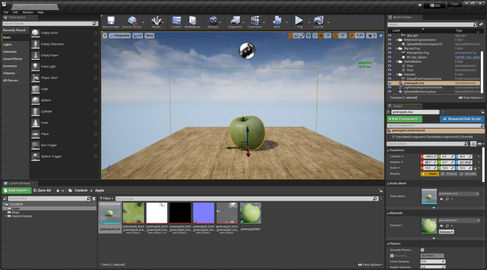

# Game Engines

Game engines are software development tools for creating interactive software. They package together libraries and software which simplify the development of interactive software. Game engines are a widely used tool in the creation of 3D software, and most engines support XR production workflows out-of-the-box.

A modern game engine will typically include:

* A 3D or 2D renderer, which supports the rendering of a moving image sequence in real-time.&#x20;
* Editor for compositing scenes and managing assets.
* Physics simulation.
* Scripting and programming tools to support dynamic, simulated and interactive elements.
* Sound processing.
* Extensions through import of third-party content, plugins and/or custom code.

There are numerous engines in use today. For real-time 3D rendering applications such as XR, [Unity](unity/) and [Unreal Engine](unreal-engine/) are currently the two most popular. Both are free to download and use non-commercially, which has contributed to their popularity.&#x20;

An important implication of using an engine is that much programming has already happened before work on a project begins. The engines provides a toolset that can be used to realise the project and generate executable software, but as a creator you do not necessarily have full control or authorship of the underlying code.&#x20;

## List of Engines

In the table below we have gathered a list of popular game engines, including information about build targets (i.e. which platforms they will build software to run on) and links to direct downloads for engine binaries and source code (where available).&#x20;

<table><thead><tr><th width="183.49540042253886">Name</th><th width="216.4000244140625">Built Target Platforms</th><th>Download</th></tr></thead><tbody><tr><td><a href="https://developer.valvesoftware.com/wiki/Source">Source</a> / <a href="https://developer.valvesoftware.com/wiki/Source_2">Source 2</a></td><td>Windows</td><td>Binaries distributed through <a href="https://store.steampowered.com/about/">Steam</a>. Source code for 2013 edition available on <a href="https://github.com/ValveSoftware/source-sdk-2013">GitHub.</a></td></tr><tr><td><a href="unity/">Unity</a></td><td>Windows; MacOS (Intel &#x26; Apple Silicon); Linux (Ubuntu and CentOS); WebGL; Android; iOS</td><td>Binaries available via <a href="https://unity.com/releases/editor/archive">Unity download archive</a>. No public source code access.</td></tr><tr><td><a href="unreal-engine/">Unreal Engine 4 / Unreal Engine 5</a></td><td>Windows; Linux (<a href="https://dev.epicgames.com/documentation/en-us/unreal-engine/linux-development-quickstart-for-unreal-engine">from source</a>); MacOS (<a href="https://dev.epicgames.com/documentation/en-us/unreal-engine/macos-development-requirements-for-unreal-engine">limited support</a>); Android; iOS</td><td>Binaries distributed through <a href="https://www.unrealengine.com/en-US/download">Epic Game Launcher</a>. Source code available on restricted access <a href="https://docs.unrealengine.com/4.27/en-US/ProgrammingAndScripting/ProgrammingWithCPP/DownloadingSourceCode/">GitHub</a> repository.</td></tr><tr><td><a href="https://godotengine.org/">Godot</a></td><td>Android; Linux; MacOS; Windows; WebGL</td><td>Binaries and source code available on <a href="https://github.com/godotengine/godot/releases">GitHub</a> and in <a href="https://godotengine.org/download">download section</a> </td></tr></tbody></table>
