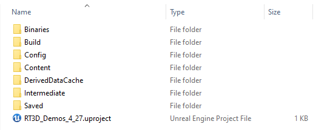

# Archiving an Unreal Engine Source Project

This page describes the process for archiving an Unreal Engine 4 or 5 project and its dependencies, so that it can be archived independently of a computer system. One way of preparing for the preservation of software made in Unreal Engine, is to archive the project files used to create it. While it is the executable form of the software (or 'build') which is used to run it, archiving the source form of the software opens up more preservation options. More detail can be found in the [Preservation Strategies](../../preservation-strategies.md) section, but these include:

* Creation of new builds which support different platforms, environments and hardware.
* Incremental migration to new versions of Unreal Engine.
* Migration to a new engine should this become necessary.

Additionally, source materials can contain rich technical history and support an understanding of how the software was developed.&#x20;

## Overview

As a rule of thumb, you want to gather and archive all the materials required to repeated the process of building the software. To build an Unreal Engine project, you need the following components:

* [**Project folder**](archiving-an-unreal-engine-source-project.md#project-folder): the collection of custom Unreal Engine content and project files;
* [**Engine binaries**](archiving-an-unreal-engine-source-project.md#engine-binaries): the editor software which allows you to open the project;
* [**Dependencies**](archiving-an-unreal-engine-source-project.md#dependencies): any additional software not included with the engine binaries by default e.g. plugins, libraries.

This page describes two different approach to archiving these components. Manual component archiving involves downloading and manually locating the various components described above. Disk image archiving involves downloading the components onto a physical or virtualized computer system and creating and archiving a disk image of the resulting software environment.&#x20;

## Disk Image Archiving

A disk image is a digital file which encapsulates the contents of a storage medium. They can be created from physical storage media or they can synthetically constructed and used as virtual devices. When created from the storage media of a physical computer, the image acts as a bit-for-bit backup of the complete software environment stored on that device. If your engine project is installed and buildable on this device, the disk image will capture all that data, including software dependencies, in situ.&#x20;

Workflow:&#x20;

1. Select a suitable computer (or set up a virtual machine) on which to install the source project. Ideally, this should be a vanilla install of your chosen operating system, to minimise the size of the resulting disk image.&#x20;
2. Install the appropriate version of Unreal Engine using the [Epic Games Launcher](https://www.epicgames.com/store/en-US/download). &#x20;

## Manual Component Archiving

Each component type, including how you can locate it, is described in detail below.&#x20;

### Project Folder

An Unreal Engine (version 4.0+) project folder is a collection of files conforming to a specific directory structure — more information on this format can be found in our introduction to [Unreal Engine](./). To archive this, the supplier will need to send you a copy of this complete directory or will need to retrieve if from their version control system. The contents of the project folder should look something like the screenshot below, containing various folders and a .uproject file.&#x20;

Something to note is that this can include assets and other materials that are not used by the final, built application. This can make the project files much larger, but also provides insight into the way it was created. If the creator of the project files offer to 'clean them up' before supplying them, you may wish to advise them against that!

Project files can include many hundreds or even thousands of files, so as a final step you may wish to zip them for convenience and reduced stored size.&#x20;

### Engine Binaries and Source Code

#### Engine Binaries

To open an Unreal Engine project you need an appropriate version of the Unreal Engine editor. To avoid errors, you should use the editor version in which the project original developed. If you use a newer version, Unreal Engine will present a warning and give you a choice of whether to proceed or not. There is a chance you can open the project successfully, but doing so may break or change things, so do so very carefully and always _using a duplicate copy_.&#x20;

<figure><figcaption>
An example Unreal Engine editor install folder, in this case it is 5.4 on Windows 10.
</figcaption></figure>

You can download prebuilt Unreal Engine binaries using the [Epic Games Launcher](https://www.epicgames.com/store/en-US/download). Once installed, the engine version can be located in your Unreal Engine install directory and zipped for archiving. Note that Android, iOS, Linux and TVOS are all optional build target platforms and need to be selected during engine installation if you wish to support them. Alternatively, you can build binaries from the the source code (see below and [Unreal Binary Builder tool](https://github.com/ryanjon2040/Unreal-Binary-Builder)).

#### Source Code

If the project involves a modified version of UE4, you will also need to archive a copy of the source code. Archiving the source code of the engine version used can also be a generally useful thing to have, as it can hold useful information for future preservation work.&#x20;

For a project using a modified Unreal Engine source code, the creator should be able to supply this or advise on where it can be found. For unmodified Unreal Engine source code, this can be pulled from the Unreal Engine [repository on GitHub](https://github.com/EpicGames/UnrealEngine). This is a private repository, so you will need to request access and link to an Epic Games account before being able to access it — see the [official instructions](https://docs.unrealengine.com/4.27/en-US/ProgrammingAndScripting/ProgrammingWithCPP/DownloadingSourceCode/).&#x20;

### Dependencies

Sometimes additional dependencies are required to open or build a UE4 project successfully.&#x20;

#### Unreal Engine Plugins

Plugins are extensions to Unreal Engine's functionality. They can be installed from the within the engine or manually. There are two default locations for plugins:&#x20;

* Unreal Engine install location: /\[UE Root]/Engine/Plugins/\[Plugin Name]/
* Project folder: /\[Project Root]/Plugins/\[Plugin Name]/

You need to make sure that any required plugins have been installed and are then archived with either the project files or engine binaries.&#x20;

#### C++ Projects

If a UE4 project involves custom C++ code, you will need to install the appropriate version of Microsoft Visual Studio (e.g. 4.27 requires Visual Studio 2019 to build such project for Windows).&#x20;
