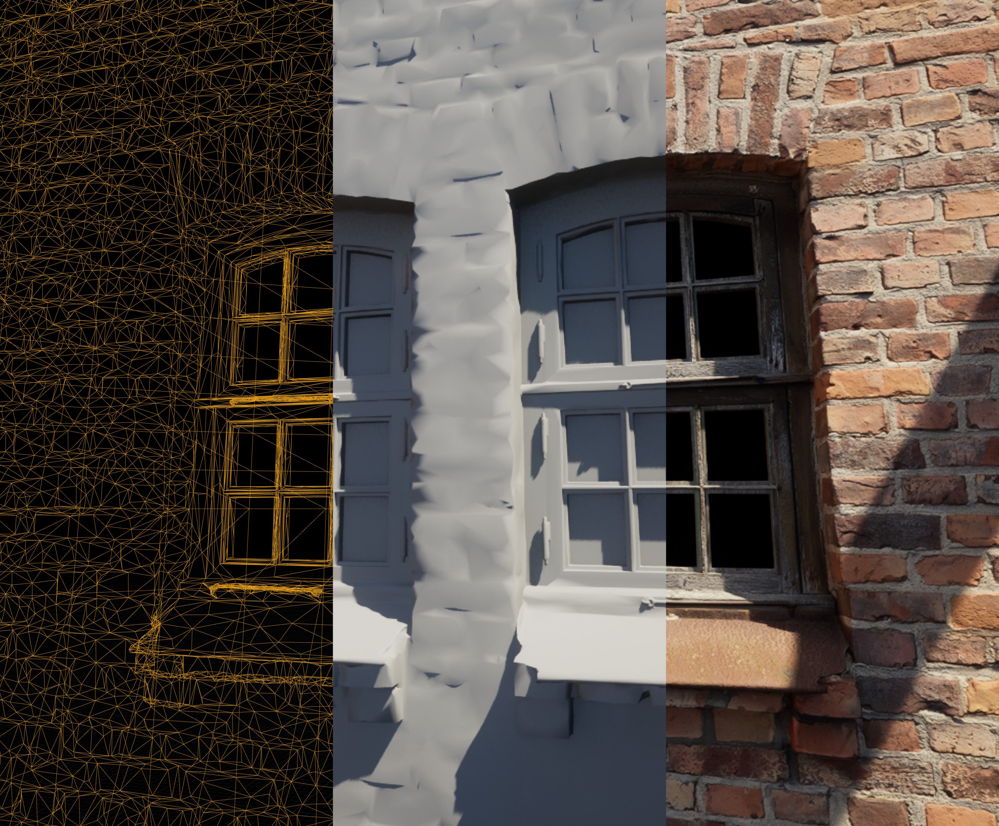

# Introduction

**3D software** is software which dynamically generates a moving image sequence from 3D data and code. The real-time nature of the process means that the moving image sequence can be dynamic and responsive to user interaction. This can be contrasted with video, where frames are encoded and played back linearly. In practice, 3D software technologies used in XR production are often very similar to those involved in the creation of video games — i.e. making use of game engines, 3D modelling, texturing.&#x20;

<figure><figcaption>
This capture from an Unreal Engine 5 project shows the breakdown of some of the key elements that go into a single frame from wireframe mesh (left) to surface illumination (center) and finally combined with surface material properties (right).
</figcaption></figure>

Existing software frameworks and tools are typically used as a starting point for development of 3D software, from which a distributable form of the software is generated. Development for desktop and mobile applications often uses the aforementioned [game engine](game-engines/), a reusable framework and package of tools which eases the development and build process. This also allows targeting of different platforms (e.g. PC, Mac, mobile, web) from the same code base. Development for the web may involve the use of web frameworks like [Three.js](https://threejs.org/) and [A-Frame](https://aframe.io/). In some cases, 3D software may be developed as code using existing libraries, frameworks and APIs.

## Assessing 3D Software

To start developing a preservation plan for 3D software, begin by thinking about how the software was created and the key characteristics that you wish to preserve. Consider the following prompts:

* What **tools** were used in its creation and why were these chosen? e.g. [game engines](game-engines/), development frameworks, version control etc.
* If a [**game engine**](game-engines/) was used:&#x20;
  * Is the specific engine **version** important?&#x20;
  * Was the engine **modified** in any way? e.g. plugins, rebuilt from source.
  * Is the game engine (and any external dependencies required to run it) still **accessible and supported** by developer?&#x20;
  *
    Can executable software still be **built from engine project** in a contemporary computing environment? This may take some effort to achieve but is a very valuable learning experience and indicates you have everything you need to maintain the software.
* What kinds of **asset** were used? e.g. 3D models, textures, audio
  * Under what circumstances were these assets sourced? e.g. custom made, third-party licenced.
  * What **tools** were used to create the assets? e.g. 3D modelling, texturing, photogrammetry, animation/rigging.
* How were any **audio** elements designed? Is sound dynamically triggered or from linear playback source?
* How **compatible** is the software with contemporary XR platforms? This will depend on how support has been built into the software during creation and how it has been distributed/displayed in the past e.g.
  * Was the software developed to run on a specific **computing platform?** e.g. Windows PC, Mac OS, Android, web platforms (e.g. A-Frame, Three.js).
  * Does the software support the [**OpenXR standard**](../preserving-xr-hardware/head-mounted-display/openxr.md)? Or was the software developed to run with a specific **XR hardware platform**? e.g. Oculus, SteamVR etc.
  * Does it make use of any external resources? e.g. additional software (e.g. Max); resources accessed via the internet etc.
* Are **source materials** available and how complex would these be to meaningfully preserve?&#x20;
  * What tools are needed to **build** the project from source materials as a standalone app/executable/webpage?&#x20;
  * Could source materials be **modified** to update the software?&#x20;
* Has **documentation of the experience** been supplied? If not, can it be created? e.g. fixed-perspective video capture, 360-degree video capture, installation photographs/video

## **Further Reading**

Adrian Courrèges (2020), _Graphics Studies Compilation_. URL: [http://www.adriancourreges.com/blog/2020/12/29/graphics-studies-compilation/](http://www.adriancourreges.com/blog/2020/12/29/graphics-studies-compilation/)

baldurk (n.d.), _Graphics in Plain Language: An introduction to how modern graphics work in video games_. URL: [https://renderdoc.org/blog/Graphics-in-Plain-Language/Part-1.html](https://renderdoc.org/blog/Graphics-in-Plain-Language/Part-1.html).

Brown University (2024), _VR Software Wiki_ . URL: [https://www.vrwiki.cs.brown.edu/](https://www.vrwiki.cs.brown.edu/)

Fabian Giesen (2011), _A trip through the Graphics Pipeline 2011_. URL: [https://fgiesen.wordpress.com/2011/07/09/a-trip-through-the-graphics-pipeline-2011-index/](https://fgiesen.wordpress.com/2011/07/09/a-trip-through-the-graphics-pipeline-2011-index/)

Library of Congress, _Recommended Formats Statement: IX. Software and Video Games._ URL: [https://www.loc.gov/preservation/resources/rfs/software-videogames.html](https://www.loc.gov/preservation/resources/rfs/software-videogames.html)
