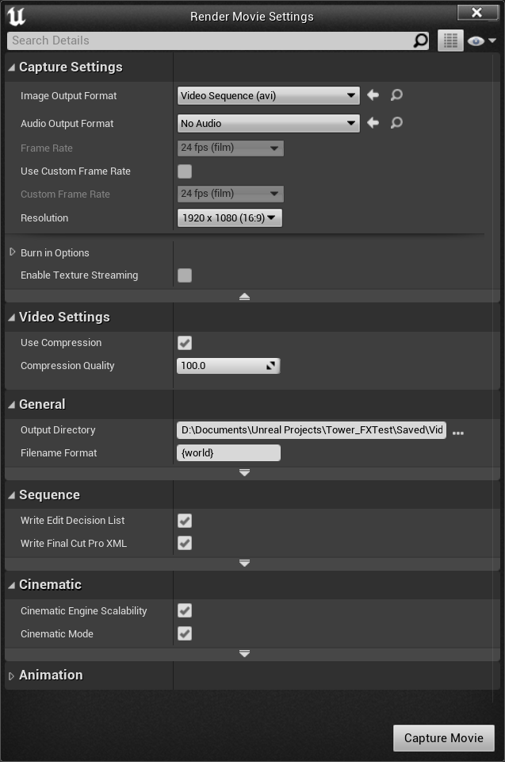
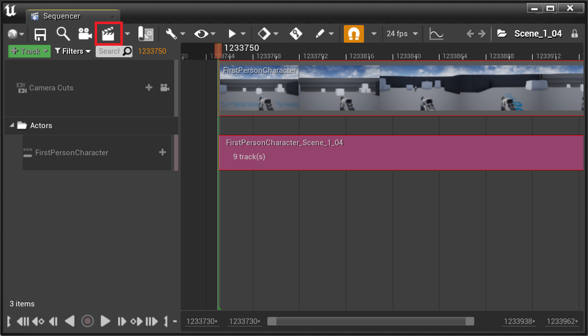

# Video Documentation

Video documentation can be used to record aspects of an immersive media (IM) experience. This can take two complementary forms:&#x20;

* Physical capture: Video recording of the real-world physical actions of a user interacting with an XR experience.&#x20;
* Virtual capture: Video recording of the virtual actions of a user interacting with an XR experience, as would be sent to a display device.&#x20;

## Virtual Video Capture

Virtual video capture can produce two kinds of video:

* **Fixed-perspective video**: video which representing a fixed perspective on the virtual environment; the standard form of video designed for non-interactive viewing.
* [**360 video**](../preserving-360-video/360-video.md): video representing a 360 degree view from a central point, therefore allowing a level of interactivity via rotational tracking.

### Capturing Video from an Application

Hardware and software tools can be used to capture video from a real-time 3D application. This can be fixed-perspective or 360-degree video, though we are not aware of any hardware tools which can capture 360-degree video from an HMD device.

#### Software Tools

<table data-full-width="false"><thead><tr><th>Tool</th><th width="213.60009765625">Description</th><th width="167.2001953125">Platform</th><th width="110.599853515625">FOSS?</th><th>360 Video Support?</th></tr></thead><tbody><tr><td><a href="https://www.amd.com/en/resources/support-articles/faqs/DH-023.html">AMD Radeon ReLive</a></td><td>Screen capture in real-time 3D applications running on an AMD Radeon graphics card.</td><td>Windows</td><td>❌</td><td></td></tr><tr><td><a href="https://www.liv.tv/">LIV</a></td><td>Live capture from spawnable cameras in Unreal and Unity game engines (required support to be built in to target application).</td><td>Windows, SteamVR</td><td>❌</td><td></td></tr><tr><td><a href="https://obsproject.com/">Open Broadcaster Software (OBS)</a></td><td>Free and open source software for video recording. Combine multiple computer sources in custom layout, with switching.</td><td>Windows, MacOS and Linux</td><td>✔️</td><td></td></tr><tr><td><a href="https://www.nvidia.com/en-gb/geforce/geforce-experience/shadowplay/">NVIDIA ShadowPlay</a></td><td>Screen capture in real-time 3D applications (no 360 video recording)</td><td>NVIDIA GeForce graphics cards</td><td>❌</td><td>❌</td></tr><tr><td><a href="https://support.microsoft.com/en-us/windows/record-a-game-clip-on-your-pc-with-xbox-game-bar-2f477001-54d4-1276-9144-b0416a307f3c">Xbox Game Bar</a></td><td></td><td>Windows</td><td>❌</td><td></td></tr><tr><td><a href="https://developer.oculus.com/blog/announcing-360-capture-sdk/">Oculus 360 Capture SDK</a></td><td>360 video recording in real-time 3D applications.</td><td>Unity, Unreal, NVIDIA and AMD GPUs</td><td>❌</td><td>✔️</td></tr><tr><td><a href="https://www.surrealcapture.com/">Surreal Capture</a></td><td>360 video recording in real-time 3D applications.</td><td>Windows</td><td>❌</td><td>✔️</td></tr><tr><td><a href="https://docs.unity3d.com/Packages/com.unity.recorder@5.1/manual/index.html">Unity Recorder Package</a></td><td>Package for the Unity game engine which allows capture of video and images.</td><td>Unity Editor 2023.1+</td><td>❌</td><td></td></tr><tr><td><a href="https://dev.epicgames.com/documentation/en-us/unreal-engine/panoramic-capture-tool-in-unreal-engine">Unreal Panoramic Capture Plugin</a></td><td>Experimental plugin that captures stereoscopic still images or video.</td><td>Unreal Engine 4.27+ (deprecated in version 5.3)</td><td>
➖ 

(EULA restrictions apply)
</td><td>✔️</td></tr><tr><td>Unreal Panoramic Rendering feature in Movie Render Queue</td><td></td><td>Unreal Engine 5.0+</td><td>
➖ 

(EULA restrictions apply)
</td><td>✔️</td></tr></tbody></table>

### Rendering Fixed-Perspective Video in the UE4 Editor


Tested in version 4.27 of the editor only.


The Unreal Engine 4 editor has built-in tools which allow export of video sequences. The actions of these sequences can be scripted or recorded from user interaction within the editor. Using them therefore requires access to the source project and a level of engagement with the editor software. This will may involve modification of the source project, so you may wish to work with a copy or version control system.&#x20;

#### Render Formats and Settings

Video export format depends on the options you select in the Render Movie Settings dialogue (info derived from MediaInfo output of a rendered video):&#x20;

* With 'Use Compression' unchecked: RGBA (8 bits-per-channel) in AVI with OpenDML extension container.
* With 'Use Compression checked: MJPG video (YUV, 4:2:2, 8 bits-per-channel), Interlaced, Top Field First) in AVI container.

There are some configurable options, including output video resolution and framerate.&#x20;

The uncompressed video option yields the best quality output but the video files produced are VERY large - during testing 8 seconds of capture (1080p at 24fps) yielded a 1.5 GB file. Take care that you have enough storage space to capture in this format if you are intending to use this setting. After capture you may wish to convert to a lossless compression format like FFV1 for storage.&#x20;

#### Workflow

In order to generate a video from a UE4 project using the editor tools, you need to first create a _sequence_: a scripted or recorded set of events occurring within the virtual environment. Some projects may already use a sequence to choreograph the actions that occur within the IM experience (e.g. an 'on-rails' experience). In these cases, locate the sequence in the Content Browser and open it. In the toolbar you should see a clapperboard icon, which will open up the Render Movie Settings dialogue.&#x20;

Where there is not an existing sequence, you can create a sequence by scripting or [recording](https://docs.unrealengine.com/4.27/en-US/AnimatingObjects/Sequencer/Overview/TRReferenceGuide/) interaction in the engine.&#x20;

### Rendering 360 Video in the UE4 Editor

360 video can be created with a workflow that utilizes plugins enabling export of stereoscopic frames from UE4, which are then assembled into a video sequence with software like Adobe After Effects (which has support for VR and 360 video).

The following workflow uses [Panoramic Capture Tool](https://docs.unrealengine.com/4.27/en-US/WorkingWithMedia/CapturingMedia/StereoPanoramicCapture/), a free plugin included with UE4.

Note that there are some caveats to using Panoramic Capture Tool:

* It does not export audio.
  * Audio could theoretically be pulled from fixed-perspective video of an "on-rails" experience, but another strategy would be required for interactive content.
* It is an Experimental feature in UE4, and is not as actively developed or supported as other UE features.
* UE v4.19 and earlier use a different version of Panoramic Capture that does not have the benefit of Blueprints, and requires some manual programming; this earlier version is not covered here.

There are other 360 export tools that can be purchased in the Unreal marketplace.

#### UE4 Panoramic Capture Tool Workflow

\[workflow to be added here]
