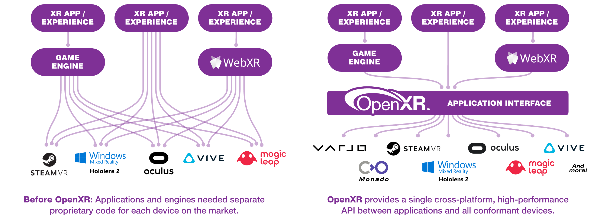

# OpenXR

[OpenXR](https://www.khronos.org/openxr/) is an open, royalty-free standard for APIs that provide XR applications with access to XR platforms and devices. This is implemented in the [XR runtime](https://app.gitbook.com/wiki/spaces/PT/pages/5308417) software supplied by the manufacturer of XR hardware and in the XR software application when it is developed (e.g. via a game engine plugin). Support for OpenXR is potentially useful for preservation purposes — it improves compatability between XR software and XR hardware, allowing modifications to be made, .&#x20;

OpenXR is developed by a working group managed by the Khronos Group consortium, who describe it as follows:

> _OpenXR is an API (Application Programming Interface) for XR applications. XR refers to a continuum of real-and-virtual combined environments generated by computers through human-machine interaction and is inclusive of the technologies associated with virtual reality (VR), augmented reality (AR) and mixed reality (MR). OpenXR is the interface between an application and an in-process or out-of-process "XR runtime system", or just "runtime" hereafter. The runtime may handle such functionality as frame composition, peripheral management, and raw tracking information._
>
> _Optionally, a runtime may support device layer plugins which allow access to a variety of hardware across a commonly defined interface._
>
> — [https://www.khronos.org/registry/OpenXR/specs/1.0/html/xrspec.html](https://www.khronos.org/registry/OpenXR/specs/1.0/html/xrspec.html)

Up until the arrival of OpenXR, support for each manufacturers API would have to be built into the XR applications if they were to be used. OpenXR attempts to solve the problem of compatibility between XR applications and XR hardware. Image source: [https://www.khronos.org/openxr/](https://www.khronos.org/openxr/).

## Using OpenXR

In order to make use of OpenXR, you need to:

1. Make use of an XR hardware platform which supports it — see [XR Hardware Support](openxr.md#xr-hardware-support) below.
2. Develop XR software which supports it (or add this to the software) — see [XR Software Support](openxr.md#xr-software-support) below.

### XR Hardware Support

The [Khronos Group report ](https://www.khronos.org/OpenXR#xr-runtimes)that the following XR runtimes/platforms are compliant with OpenXR:&#x20;

* **Acer**: [Spatial Display Series](https://www.acer.com/gb-en/monitors/spatiallabs)
* **ByteDance**: [Neo3, PICO4 and PICO4 Ultra](https://developer-global.pico-interactive.com/sdk?deviceId=1\&platformId=3\&itemId=11)
* **Canon**: [MREAL Platform Displays and Headsets](https://www.canon-its.co.jp/files/user/solution/mr/lp/)
* **Collabora**: [Monado open-source OpenXR runtime](http://monado.dev/)
* **HTC**: [Vive Focus 3, Vive Cosmos & Vive Wave](https://developer.vive.com/resources/openxr/)
* **Magic Leap**: [Magic Leap 2](https://developer-docs.magicleap.cloud/docs/guides/native/native-openxr-setup)
* **Meta**: [Quest 3, Quest Pro, Quest 2, Quest and Rift S and Meta XR Simulator](https://developer.oculus.com/documentation/native/pc/dg-openxr)
* **Microsoft**: [Hololens and Mixed Reality Headsets](https://aka.ms/openxr)
* **Qualcomm**: [Snapdragon Spaces](https://spaces.qualcomm.com/)
* **Sony**: [Spatial Reality Displays (ELF-SR1 & ELF-SR2)](https://pro.sony/ue_US/products/spatial-reality-displays/3d-professional-images)
* **SteamVR**: [All supported headsets](http://steamvr.com/)
* **Varjo**: [All Varjo headsets](https://developer.varjo.com/docs/openxr/openxr)

### XR Software Support

The following game engines have native support for OpenXR:

* **Godot**: 4.0+ (built-in); 3.2-3.6 (via plugin)
* **Unity**: 2020.2+ (via [plugin](https://docs.unity3d.com/Packages/com.unity.xr.openxr@1.17/manual/index.html))
* **Unreal Engine 4**: 4.27 (via plugin); 4.24-4.26 (via beta plugin)
* **Unreal Engine 5**: 5.0+ (via plugin)

As of Chromium 81, any Chromium-based web browser (e.g. Chrome, Edge) will use OpenXR as its default backend for WebXR content.
