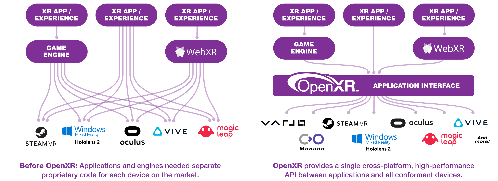

# OpenXR

[OpenXR](https://www.khronos.org/openxr/) is an open, royalty-free standard for APIs that provide XR applications with access to XR platforms and devices. This is implemented in the [XR runtime](https://app.gitbook.com/wiki/spaces/PT/pages/5308417) software supplied by the manufacturer of XR hardware. Application support for OpenXR is potentially useful for preservation purposes — as it is a _open_ standard, which will make keeping software available that

OpenXR is developed by a working group managed by the Khronos Group consortium, who describe it as follows:

> _OpenXR is an API (Application Programming Interface) for XR applications. XR refers to a continuum of real-and-virtual combined environments generated by computers through human-machine interaction and is inclusive of the technologies associated with virtual reality (VR), augmented reality (AR) and mixed reality (MR). OpenXR is the interface between an application and an in-process or out-of-process "XR runtime system", or just "runtime" hereafter. The runtime may handle such functionality as frame composition, peripheral management, and raw tracking information._
>
> _Optionally, a runtime may support device layer plugins which allow access to a variety of hardware across a commonly defined interface._
>
> — [https://www.khronos.org/registry/OpenXR/specs/1.0/html/xrspec.html](https://www.khronos.org/registry/OpenXR/specs/1.0/html/xrspec.html)

Up until the arrival of OpenXR, support for each manufacturers API would have to be built into the XR applications if they were to be used.OpenXR attempts to solve the problem of compatibility between XR applications and XR hardware. Image source: [https://www.khronos.org/openxr/](https://www.khronos.org/openxr/).

## Using OpenXR

In order to make use of OpenXR, you need to:

1. Develop software which supports — see Engine Implementations below.
2. Make use of an XR platform which supports it — see XR Runtime Implementations below.

## XR Runtime Implementations

The [Khronos Group report ](https://www.khronos.org/OpenXR#xr-runtimes)that the following XR runtimes/platforms are compliant with OpenXR:&#x20;

* Acer: [Spatial Display Series](https://www.acer.com/gb-en/monitors/spatiallabs)
* ByteDance: [Neo3 and PICO4](https://developer-global.pico-interactive.com/sdk?deviceId=1\&platformId=3\&itemId=11)
* Canon: [MREAL Platform Displays and Headsets](https://www.canon-its.co.jp/files/user/solution/mr/lp/)
* Collabora: [Monado open-source OpenXR runtime](http://monado.dev/)
* HTC: [Vive Focus 3, Vive Cosmos & Vive Wave](https://developer.vive.com/resources/openxr/)
* Magic Leap: [Magic Leap 2](https://developer-docs.magicleap.cloud/docs/guides/native/native-openxr-setup)
* Meta: [Quest 3, Quest Pro, Quest 2, Quest and Rift S and Meta XR Simulator](https://developer.oculus.com/documentation/native/pc/dg-openxr)
* Microsoft: [Hololens and Mixed Reality Headsets](https://aka.ms/openxr)
* Qualcomm: [Snapdragon Spaces](https://www.qualcomm.com/developer/blog/2022/09/snapdragon-spaces-openxr-implementation-developing-headworn-ar-experiences)
* Sony: [Spatial Reality Displays (ELF-SR1 & ELF-SR2)](https://pro.sony/ue_US/products/spatial-reality-displays/3d-professional-images)
* SteamVR: [All supported headsets](http://steamvr.com/)
* Varjo: [All Varjo headsets](https://developer.varjo.com/docs/openxr/openxr)

## Engine Implementations

| **Engine**      | **Versions Supporting OpenXR**             | **Supported Runtimes**                                                                      |
| --------------- | ------------------------------------------ | ------------------------------------------------------------------------------------------- |
| Unreal Engine 4 | 4.27 (via plugin); 4.24+ (via beta plugin) | Windows Mixed Reality; Oculus (via Oculus OpenXR plugin); SteamVR (via SteamVR Beta opt-in) |
| Unity           | 2020.2+ (via plugin)                       | Windows Mixed Reality; HoloLens 2                                                           |
