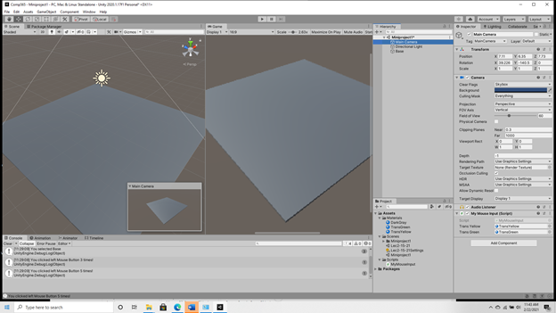

# Unity

The Unity Engine was initially released in 2005 for the purposes of democratizing the game development industry. Its goal was to provide professional but affordable game development tools aimed mainly at amateur game developers. Unity can create both 2D and 3D applications. The engine typically has a major version update every year with multiple smaller updates throughout the year. Unity is free for developers that bring in under $100,000 in revenue in a 12-month period. After that, there are 2 different pricing models.  Though originally designed to build games, today Unity is used across multiple industries including automotive, architecture, engineering, construction, film, education, and retail.

### Anatomy of a Unity Project Folder

When a new project is created, Unity creates several folders as a part of the project. Over the years and versions of Unity, this default folder structure has changed somewhat, but it now generally contains the following folders:

.png>)

**Assets**

This is the folder where all game resources are stored, including scripts, textures, sound, and custom editor scripts. The organization of the folder can vary greatly from one project to another and from one organization to another. There can be numerous subfolders in the Assets folder, depending on how the project is organized. For example, there may be a folder for scenes, one for scripts, one for audio, or one for sprites. There is no limit to how deep the organization can be.

As a best practice, subfolders in the Assets folder should be created within Unity and not the computer's local file system. Likewise, assets should be added directly to the folders in the Unity Editor and not the file explorer as seen above. This is particularly important due to the way Unity constructs metadata for assets.

Unity reserves several special folder names under the asset folder. These folders are Editor, Editor Default Resources, Gizmos, Resources, Standard Assets, and Streaming Assets. Not every project will have all of these folders.

**Assets/Editor** — This folder is for custom editor scripts that extend the functionality of the Unity editor. These scripts will run in the editor but not in the project at runtime. Multiple Editor folders can exist in the Assets Folder. The execution of the editor scripts varies depending on where in the folder structure the editor file exists.

**Assets/Editor Default Resources** — This is where asset files used by Editor scripts are stored. There can only be one such folder and it must be placed in the Assets folder root. There can be subfolders in this folder.

**Assets/Gizmos —** Gizmos are graphics in the scene view which can help to visualize design details. This folder stores images used for gizmos. There can only be one folder and it must be placed in the Assets folder root. Gizmo examples are seen below with the red squares around them. The one on the left is the main camera’s position and rotation. The one on the right represents a light source. These two are Unity built in gizmos:

.png>)

**Assets/Resources —** This folder stores resources so that they can be loaded on demand in a Unity project. There can be multiple resource folders. On demand loading is helpful for dynamically loading game objects that don’t have instances created by designers during design time. In other words, these resources may not have corresponding game objects placed in the scene at design time and can be loaded dynamically at run time.

**Assets/Standard Assets —** This folder stores any standard asset packages that have been imported into a project. There can be only one standard assets folder. Standard assets are free assets maintained by Unity.

**Assets/Streaming Assets** — This folder is for assets that will remain in their original format and later be streamed into the Unity application, instead of directly incorporating them into the project’s build. An example would be a video file from the filesystem. There can only be 1 streaming assets folder in the project.

**Library**

Moving on from the Assets folder, the next folder is Library. This is a local cache used by Unity for imported assets. It can be deleted and will be regenerated by unity automatically. All that is needed to recreate the folder are source assets and .meta files. If this folder is deleted, Unity will reimport all asset information and regenerate the folder the next time the project is opened in the editor. This folder should not be included in Version Control. These imported assets are used by Unity to save time when Unity is running.

Of special note in the Library folder is the package cache folder. This contains information about all the packages installed with the current project. Though this can be regenerated by Unity like the other items in the Library folder, for archival purposes, it is important that this file not be deleted. This is because it may be helpful to be able to see what packages are included in the project without having to regenerate the cache, which would require opening the project in its appropriate editor version.&#x20;

**Packages**

This folder contains the manifest file in JSON format used to maintain the dependencies link between packages. The manifest file is used to regenerate the package cache in the library folder.  It also contains a file listing the individual packages installed with the project. These are used by the Unity Package Manager. The package manager was added in Unity 2018.1. Prior versions of Unity will not contain the package manager and the packages folder will not exist in those cases.

**Project Settings**

This folder contains all project settings from the project settings menu. It also includes editor version number and build settings and a slew of other settings used by Unity systems. Editor version number, as a standalone file, was not added until Unity 5. For any version before that, the editor version number can be found in the project settings file.

&#x20;
